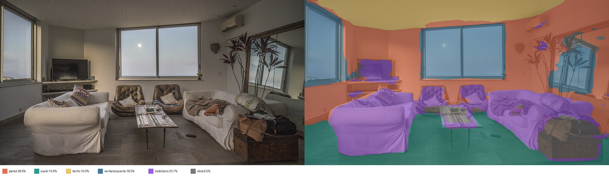
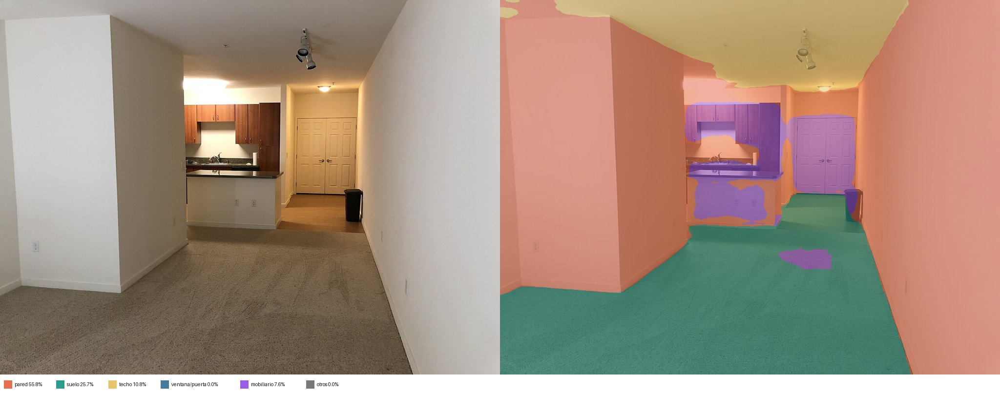
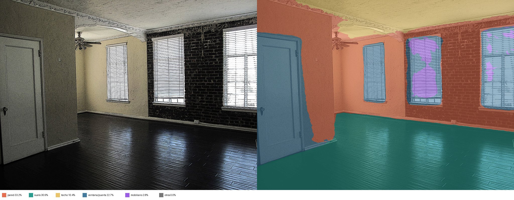
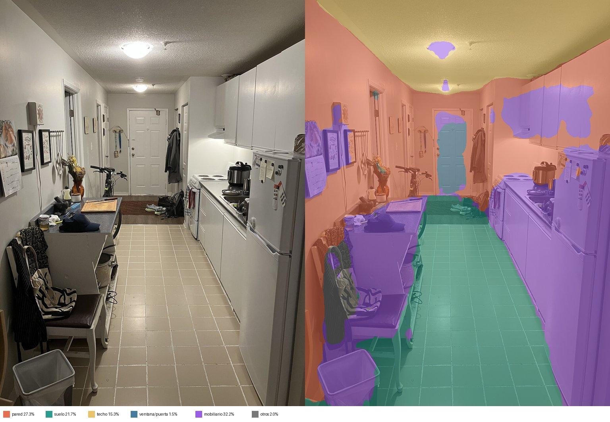
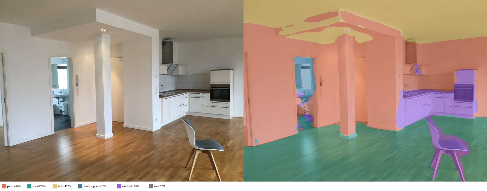
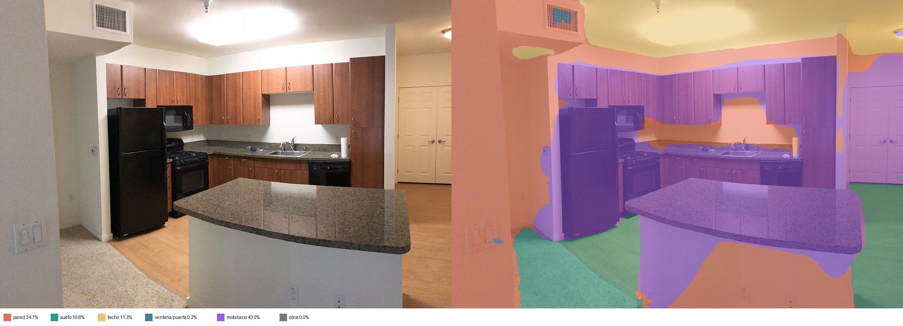
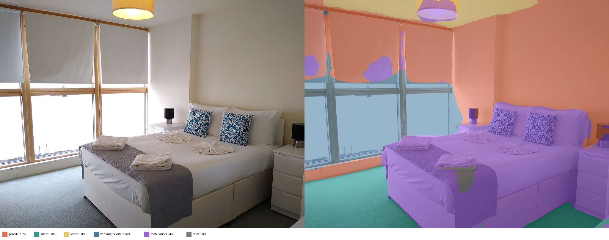
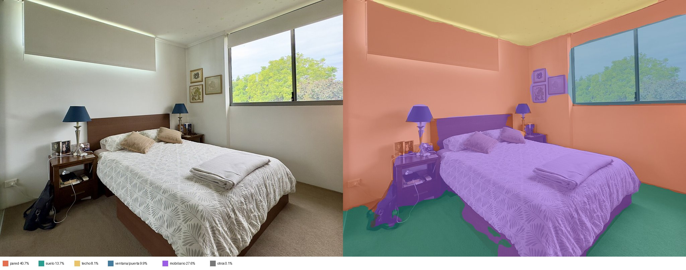
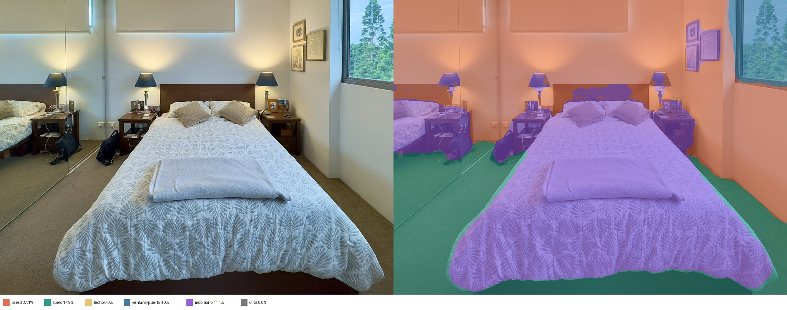
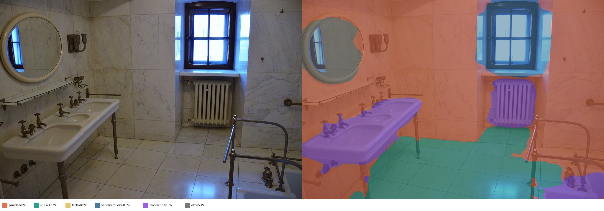

# Validación de la segmentación por zonas

Modelo: `nvidia/segformer-b0-finetuned-ade-512-512` (ADE20K, CPU). Cada imagen: original a la izquierda, zonas a la derecha.
Formato de celda: % de la foto (confianza media del modelo en esa zona, 0–1).

| # | Tipo | pared | suelo | techo | ventana/puerta | mobiliario | otros | Avisos |
|---|---|---|---|---|---|---|---|---|
| 1 | apartment living room | 28.6% (0.81) | 15.6% (0.89) | 10.0% (0.91) | 18.5% (0.86) | 20.7% (0.48) | 6.5% (0.33) | confianza baja en mobiliario |
| 2 | apartment living room | 55.8% (0.95) | 25.7% (0.95) | 10.8% (0.94) | 0.0% (0.26) | 7.6% (0.53) | 0.0% (-) | confianza baja en mobiliario |
| 3 | apartment living room | 33.2% (0.88) | 30.9% (0.98) | 10.4% (0.91) | 22.7% (0.75) | 2.8% (0.57) | 0.0% (-) | ok |
| 4 | apartment kitchen | 27.3% (0.73) | 21.7% (0.92) | 15.3% (0.97) | 1.5% (0.49) | 32.2% (0.6) | 2.0% (0.28) | ok |
| 5 | apartment kitchen | 43.9% (0.86) | 27.3% (0.95) | 18.0% (0.92) | 1.8% (0.5) | 9.0% (0.62) | 0.0% (-) | ok |
| 6 | apartment kitchen | 34.7% (0.81) | 10.8% (0.88) | 11.3% (0.94) | 0.2% (0.29) | 43.0% (0.79) | 0.0% (-) | ok |
| 7 | apartment bedroom | 37.5% (0.89) | 9.0% (0.94) | 3.8% (0.77) | 15.6% (0.89) | 33.4% (0.8) | 0.6% (0.56) | ok |
| 8 | apartment bedroom | 40.7% (0.93) | 13.7% (0.94) | 8.1% (0.95) | 9.9% (0.96) | 27.6% (0.85) | 0.1% (0.14) | ok |
| 9 | apartment bedroom | 37.1% (0.94) | 17.9% (0.91) | 0.0% (-) | 4.0% (0.94) | 41.1% (0.86) | 0.0% (-) | ok |
| 10 | apartment bathroom | 55.0% (0.9) | 17.7% (0.88) | 0.0% (-) | 8.6% (0.89) | 13.3% (0.81) | 5.4% (0.82) | ok |

## 01 — apartment living room

Clases principales: wall 29%, windowpane 19%, floor 16%, armchair 12%, ceiling 10%, basket 4%

## 02 — apartment living room

Clases principales: wall 56%, floor 26%, ceiling 11%, cabinet 5%, wardrobe 2%, stove 1%

## 03 — apartment living room

Clases principales: wall 33%, floor 31%, door 13%, ceiling 10%, windowpane 10%, blind 3%

## 04 — apartment kitchen

Clases principales: wall 27%, floor 22%, cabinet 22%, ceiling 15%, chair 4%, refrigerator 3%

## 05 — apartment kitchen

Clases principales: wall 44%, floor 27%, ceiling 18%, cabinet 5%, chair 3%, door 2%

## 06 — apartment kitchen

Clases principales: wall 35%, cabinet 18%, kitchen island 14%, ceiling 11%, floor 11%, refrigerator 7%

## 07 — apartment bedroom

Clases principales: wall 38%, bed 22%, windowpane 16%, floor 9%, ceiling 4%, table 3%

## 08 — apartment bedroom

Clases principales: wall 41%, bed 21%, floor 14%, windowpane 10%, ceiling 8%, table 4%

## 09 — apartment bedroom

Clases principales: wall 37%, bed 33%, floor 18%, table 5%, windowpane 4%, painting 1%

## 10 — apartment bathroom

Clases principales: wall 55%, floor 18%, windowpane 9%, sink 8%, mirror 5%, radiator 3%

## Descartadas automáticamente

- ninguna

## Atribución de las fotos

- 01: [File:Living room in apartment of Condomínio do Edifício Zaher, Le Blond, Rio de Janeiro, Brazil.jpg](https://commons.wikimedia.org/wiki/File:Living_room_in_apartment_of_Condom%C3%ADnio_do_Edif%C3%ADcio_Zaher,_Le_Blond,_Rio_de_Janeiro,_Brazil.jpg) — Wilfredor, CC0
- 02: [File:Apartment Living Room 4 2018-09-28.jpg](https://commons.wikimedia.org/wiki/File:Apartment_Living_Room_4_2018-09-28.jpg) — FASTILY, CC BY-SA 4.0
- 03: [File:Empty apartment living room.jpg](https://commons.wikimedia.org/wiki/File:Empty_apartment_living_room.jpg) — Downtowngal, CC BY-SA 3.0
- 04: [File:A Dingy Apartment Kitchen in Canada.jpg](https://commons.wikimedia.org/wiki/File:A_Dingy_Apartment_Kitchen_in_Canada.jpg) — Gogerr, CC BY-SA 4.0
- 05: [File:Empty apartment in Berlin with fitted kitchen and chair.jpg](https://commons.wikimedia.org/wiki/File:Empty_apartment_in_Berlin_with_fitted_kitchen_and_chair.jpg) — SmashingIt99, CC0
- 06: [File:Apartment Kitchen 1 2018-09-28.jpg](https://commons.wikimedia.org/wiki/File:Apartment_Kitchen_1_2018-09-28.jpg) — FASTILY, CC BY-SA 4.0
- 07: [File:Bedroom in a serviced apartment in London.jpg](https://commons.wikimedia.org/wiki/File:Bedroom_in_a_serviced_apartment_in_London.jpg) — Mx. Granger, CC0
- 08: [File:Bedroom, Interior of apartment in Brisbane, 2025, 02.jpg](https://commons.wikimedia.org/wiki/File:Bedroom,_Interior_of_apartment_in_Brisbane,_2025,_02.jpg) — Chris Olszewski, CC BY-SA 4.0
- 09: [File:Bedroom, Interior of apartment in Brisbane, 2025, 01.jpg](https://commons.wikimedia.org/wiki/File:Bedroom,_Interior_of_apartment_in_Brisbane,_2025,_01.jpg) — Chris Olszewski, CC BY-SA 4.0
- 10: [File:02023 0113 Bathroom, Presidential private apartment in Wawel Castle.jpg](https://commons.wikimedia.org/wiki/File:02023_0113_Bathroom,_Presidential_private_apartment_in_Wawel_Castle.jpg) — Silar, CC BY-SA 4.0
