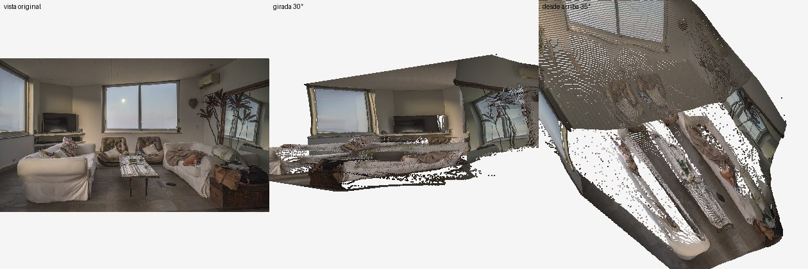
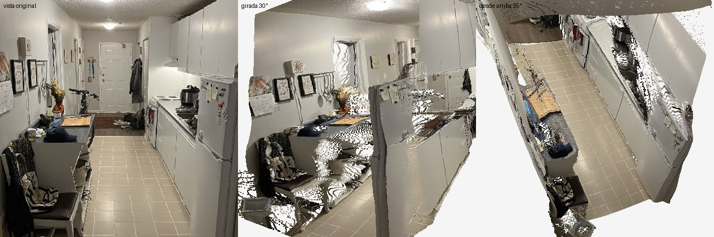
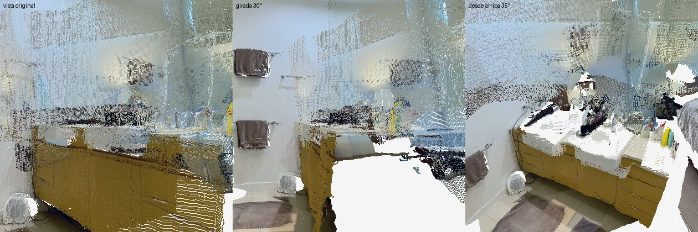
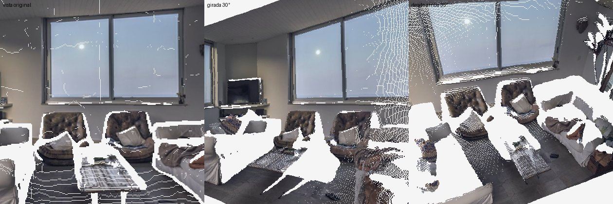

# Reconstrucción 3D de habitaciones: candidatas y pruebas

Metadatos consultados en vivo (Hugging Face y GitHub) en esta ejecución. Pruebas en la CPU de un runner de GitHub Actions (4 núcleos, sin GPU).

## Candidatas

| Herramienta | Entrada | Licencia pesos (ficha HF) | Acceso | Licencia código | ★ GitHub | Última actividad | Descargas HF |
|---|---|---|---|---|---|---|---|
| Depth Anything V2 Small | 1 foto | apache-2.0 | libre | Apache-2.0 | 8873 | 2026-03-24 | 2711667 |
| MoGe-2 (ViT-L) | 1 foto | mit | libre | NOASSERTION | 2981 | 2026-09-09 | 0 |
| Depth Pro (Apple) | 1 foto | apple-amlr | libre | NOASSERTION | 5730 | 2026-09-11 | 5492 |
| InSpace (panorámica 360°) | 1 panorámica | mit | libre | — | — | 2026-07-13 | 0 |
| MapAnything (Apache) | varias fotos | apache-2.0 | libre | Apache-2.0 | 3769 | 2026-08-07 | 48139 |
| VGGT-1B-Commercial | varias fotos | other | restringido | NOASSERTION | 14435 | 2026-05-19 | 3356 |
| MASt3R | varias fotos | ? | libre | NOASSERTION | 3116 | 2025-06-30 | 36516 |
| SpatialLM 1.1 | nube → planta | cc-by-nc-4.0 | libre | NOASSERTION | 4744 | 2026-06-26 | 29599 |
| gsplat (entrenar Gaussian Splat) | vídeo/fotos | — | — | Apache-2.0 | 5733 | 2026-09-19 | — |
| OpenSplat | vídeo/fotos | — | — | AGPL-3.0 | 2197 | 2026-09-16 | — |
| SuperSplat (visor/editor web) | visor | — | — | MIT | 10270 | 2026-09-23 | — |

## Pruebas con fotos reales

| Método | Caso | Resultado | Tiempo CPU | Puntos | Notas |
|---|---|---|---|---|---|
| depth_anything_v2_small | 01 | ✅ | 1.7 s | 570368 | {'note': 'profundidad relativa; FOV supuesto 60°'} |
| depth_anything_v2_small | 04 | ✅ | 1.1 s | 786432 | {'note': 'profundidad relativa; FOV supuesto 60°'} |
| moge2 | 01 | ❌ RuntimeError: Input type (c10::Half) and bias type (float) should be the same | 0.0 s | — |  |
| moge2 | 04 | ❌ RuntimeError: Input type (c10::Half) and bias type (float) should be the same | 0.0 s | — |  |
| mapanything_apache | multi | ✅ | 69.3 s | 761453 | {'vistas': 4} |
| mapanything_apache | single_01 | ✅ | 12.2 s | 141680 | {'vistas': 1} |
| vggt_1b_commercial | multi | ❌ GatedRepoError: 403 Client Error. (Request ID: Root=1-6ab99b10-5b44881646de076c3f7b420a;df5482f1-8c3c-4ec5-9c0f-763003244d04)

Cannot access gated repo for url  | 0.0 s | — |  |

## Vistas (original, girada 30°, desde arriba)

### depth_anything_v2_small — 01

Nube: `depth_anything_v2_small/01.glb`

### depth_anything_v2_small — 04

Nube: `depth_anything_v2_small/04.glb`

### mapanything_apache — multi

Nube: `mapanything_apache/multi.glb`

### mapanything_apache — single_01

Nube: `mapanything_apache/single_01.glb`

## Fotos de entrada

- [File:Living room in apartment of Condomínio do Edifício Zaher, Le Blond, Rio de Janeiro, Brazil.jpg](https://commons.wikimedia.org/wiki/File:Living_room_in_apartment_of_Condom%C3%ADnio_do_Edif%C3%ADcio_Zaher,_Le_Blond,_Rio_de_Janeiro,_Brazil.jpg) — Wilfredor, CC0
- [File:A Dingy Apartment Kitchen in Canada.jpg](https://commons.wikimedia.org/wiki/File:A_Dingy_Apartment_Kitchen_in_Canada.jpg) — Gogerr, CC BY-SA 4.0
- [File:Bathroom, Interior of apartment in Brisbane, 2025, 07.jpg](https://commons.wikimedia.org/wiki/File:Bathroom,_Interior_of_apartment_in_Brisbane,_2025,_07.jpg) — Chris Olszewski, CC BY-SA 4.0
- [File:Bathroom, Interior of apartment in Brisbane, 2025, 08.jpg](https://commons.wikimedia.org/wiki/File:Bathroom,_Interior_of_apartment_in_Brisbane,_2025,_08.jpg) — Chris Olszewski, CC BY-SA 4.0
- [File:Bedroom, Interior of apartment in Brisbane, 2025, 01.jpg](https://commons.wikimedia.org/wiki/File:Bedroom,_Interior_of_apartment_in_Brisbane,_2025,_01.jpg) — Chris Olszewski, CC BY-SA 4.0
- [File:Bedroom, Interior of apartment in Brisbane, 2025, 02.jpg](https://commons.wikimedia.org/wiki/File:Bedroom,_Interior_of_apartment_in_Brisbane,_2025,_02.jpg) — Chris Olszewski, CC BY-SA 4.0