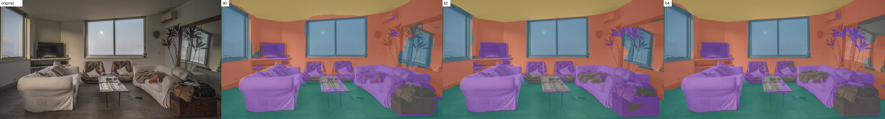
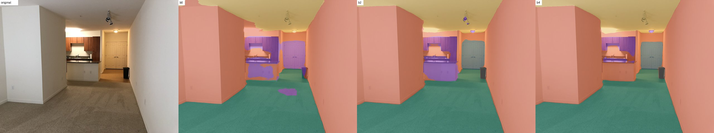
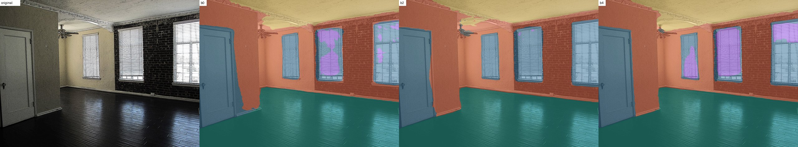
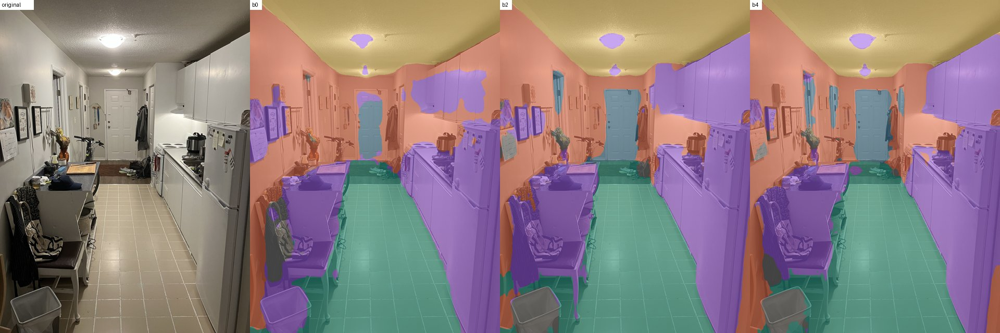
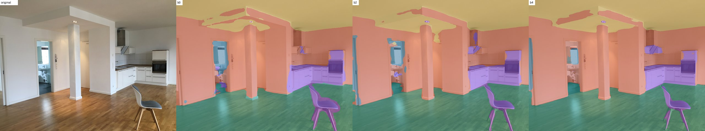
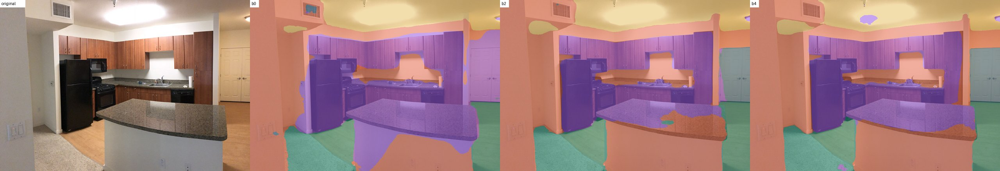
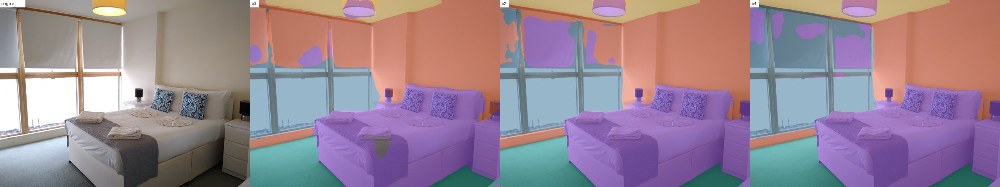
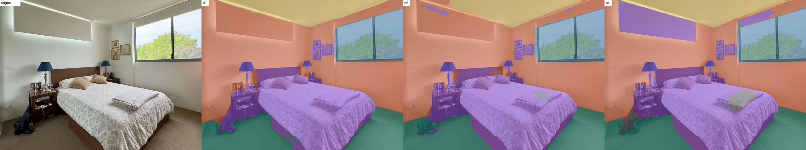
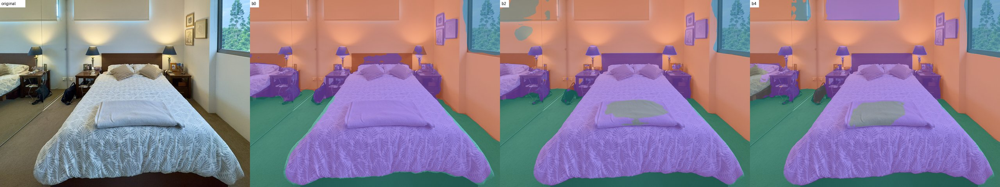
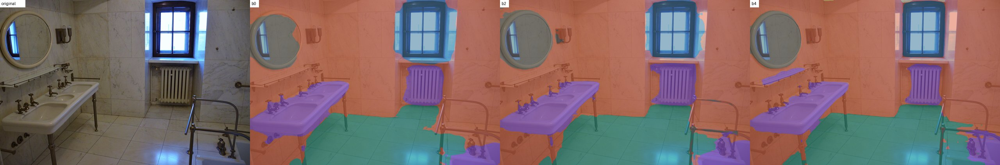

# Ronda 3: SegFormer b0 vs b2 vs b4

Mismas 10 fotos que la ronda 2. Cada imagen: original | b0 | b2 | b4.
Celdas: % de la foto (confianza media). Tiempo: segundos por foto en la CPU del runner de GitHub (2 núcleos).

## Resumen por modelo

| Modelo | Tiempo medio/foto | Confianza media pared | suelo | techo | ventana/puerta | mobiliario |
|---|---|---|---|---|---|---|
| b0 | 0.88 s | 0.87 | 0.92 | 0.91 | 0.78 | 0.69 |
| b2 | 2.71 s | 0.92 | 0.96 | 0.96 | 0.87 | 0.83 |
| b4 | 3.19 s | 0.94 | 0.97 | 0.96 | 0.89 | 0.86 |

## Por foto

| # | Tipo | Modelo | pared | suelo | techo | ventana/puerta | mobiliario | otros |
|---|---|---|---|---|---|---|---|---|
| 1 | apartment living room | b0 | 28.6% (0.81) | 15.6% (0.89) | 10.0% (0.91) | 18.5% (0.86) | 20.7% (0.48) | 6.5% (0.33) |
| 1 | apartment living room | b2 | 26.6% (0.89) | 15.2% (0.96) | 10.9% (0.98) | 18.7% (0.9) | 24.5% (0.66) | 4.1% (0.6) |
| 1 | apartment living room | b4 | 27.2% (0.88) | 15.0% (0.97) | 10.7% (0.98) | 15.4% (0.97) | 21.7% (0.79) | 9.9% (0.75) |
| 2 | apartment living room | b0 | 55.8% (0.95) | 25.7% (0.95) | 10.8% (0.94) | 0.0% (0.26) | 7.6% (0.53) | 0.0% (-) |
| 2 | apartment living room | b2 | 54.0% (0.98) | 25.9% (0.98) | 11.8% (0.97) | 2.7% (0.94) | 5.3% (0.8) | 0.3% (0.81) |
| 2 | apartment living room | b4 | 57.0% (0.99) | 25.9% (0.99) | 12.0% (0.98) | 2.4% (0.96) | 2.3% (0.81) | 0.3% (0.93) |
| 3 | apartment living room | b0 | 33.2% (0.88) | 30.9% (0.98) | 10.4% (0.91) | 22.7% (0.75) | 2.8% (0.57) | 0.0% (-) |
| 3 | apartment living room | b2 | 35.3% (0.95) | 30.5% (0.99) | 9.3% (0.94) | 24.6% (0.92) | 0.0% (0.52) | 0.3% (0.58) |
| 3 | apartment living room | b4 | 33.5% (0.96) | 30.8% (0.99) | 10.6% (0.95) | 18.8% (0.89) | 6.3% (0.83) | 0.1% (0.48) |
| 4 | apartment kitchen | b0 | 27.3% (0.73) | 21.7% (0.92) | 15.3% (0.97) | 1.5% (0.49) | 32.2% (0.6) | 2.0% (0.28) |
| 4 | apartment kitchen | b2 | 21.6% (0.82) | 21.8% (0.94) | 15.3% (0.98) | 3.4% (0.83) | 34.8% (0.81) | 3.2% (0.72) |
| 4 | apartment kitchen | b4 | 23.8% (0.85) | 22.6% (0.94) | 15.4% (0.98) | 4.0% (0.82) | 31.4% (0.82) | 2.9% (0.65) |
| 5 | apartment kitchen | b0 | 43.9% (0.86) | 27.3% (0.95) | 18.0% (0.92) | 1.8% (0.5) | 9.0% (0.62) | 0.0% (-) |
| 5 | apartment kitchen | b2 | 41.9% (0.88) | 28.1% (0.98) | 19.4% (0.95) | 2.7% (0.53) | 7.8% (0.73) | 0.0% (-) |
| 5 | apartment kitchen | b4 | 43.6% (0.93) | 28.6% (0.98) | 18.8% (0.96) | 1.4% (0.62) | 7.6% (0.86) | 0.1% (0.48) |
| 6 | apartment kitchen | b0 | 34.7% (0.81) | 10.8% (0.88) | 11.3% (0.94) | 0.2% (0.29) | 43.0% (0.79) | 0.0% (-) |
| 6 | apartment kitchen | b2 | 46.8% (0.94) | 11.7% (0.92) | 11.4% (0.95) | 3.6% (0.89) | 26.5% (0.89) | 0.0% (-) |
| 6 | apartment kitchen | b4 | 45.0% (0.97) | 11.4% (0.94) | 11.5% (0.95) | 3.8% (0.98) | 28.3% (0.91) | 0.0% (-) |
| 7 | apartment bedroom | b0 | 37.5% (0.89) | 9.0% (0.94) | 3.8% (0.77) | 15.6% (0.89) | 33.4% (0.8) | 0.6% (0.56) |
| 7 | apartment bedroom | b2 | 30.9% (0.9) | 9.0% (0.99) | 4.3% (0.94) | 17.5% (0.87) | 38.3% (0.87) | 0.0% (-) |
| 7 | apartment bedroom | b4 | 24.9% (0.98) | 8.9% (0.99) | 4.3% (0.95) | 24.2% (0.87) | 37.7% (0.89) | 0.0% (0.3) |
| 8 | apartment bedroom | b0 | 40.7% (0.93) | 13.7% (0.94) | 8.1% (0.95) | 9.9% (0.96) | 27.6% (0.85) | 0.1% (0.14) |
| 8 | apartment bedroom | b2 | 40.8% (0.93) | 13.4% (0.96) | 6.8% (0.96) | 10.1% (0.97) | 28.4% (0.91) | 0.3% (0.48) |
| 8 | apartment bedroom | b4 | 32.9% (0.97) | 13.3% (0.97) | 7.7% (0.97) | 10.1% (0.97) | 34.2% (0.92) | 1.8% (0.52) |
| 9 | apartment bedroom | b0 | 37.1% (0.94) | 17.9% (0.91) | 0.0% (-) | 4.0% (0.94) | 41.1% (0.86) | 0.0% (-) |
| 9 | apartment bedroom | b2 | 34.1% (0.93) | 17.5% (0.92) | 0.0% (-) | 4.1% (0.95) | 40.3% (0.88) | 4.0% (0.64) |
| 9 | apartment bedroom | b4 | 32.1% (0.96) | 17.0% (0.95) | 0.0% (-) | 4.7% (0.92) | 42.2% (0.93) | 3.9% (0.7) |
| 10 | apartment bathroom | b0 | 55.0% (0.9) | 17.7% (0.88) | 0.0% (-) | 8.6% (0.89) | 13.3% (0.81) | 5.4% (0.82) |
| 10 | apartment bathroom | b2 | 54.5% (0.95) | 17.5% (0.94) | 0.0% (-) | 7.3% (0.92) | 13.8% (0.9) | 6.9% (0.94) |
| 10 | apartment bathroom | b4 | 55.7% (0.96) | 20.0% (0.93) | 0.1% (0.62) | 5.6% (0.95) | 12.5% (0.89) | 6.1% (0.96) |

