# Validación de la detección de estilo (CLIP zero-shot)

Estilo esperado = el de la búsqueda (aproximado; revisar las fotos). `?` = caso difícil sin estilo claro (habitación vacía, poca luz).
Celda: top-1 (probabilidad) · margen sobre el 2.º.

| # | Esperado | base32 | large14 |
|---|---|---|---|
| 1 | Rústico | ❌ Industrial (0.46) · +0.08 | ✅ Rústico (0.94) · +0.92 |
| 2 | Rústico | ✅ Rústico (0.73) · +0.63 | ✅ Rústico (0.60) · +0.36 |
| 3 | Rústico | ❌ (exterior) (0.99) · +0.99 | ❌ (exterior) (0.61) · +0.42 |
| 4 | Rústico | ❌ (exterior) (1.00) · +0.99 | ❌ (exterior) (0.94) · +0.90 |
| 5 | Industrial | ❌ (exterior) (0.86) · +0.75 | ❌ (exterior) (0.89) · +0.80 |
| 6 | Industrial | ❌ (exterior) (0.60) · +0.22 | ❌ (exterior) (0.69) · +0.39 |
| 7 | Minimalista | ❌ Moderno (0.50) · +0.15 | ✅ Minimalista (0.67) · +0.36 |
| 8 | Minimalista | ✅ Minimalista (0.48) · +0.21 | ❌ Moderno (0.45) · +0.05 |
| 9 | Moderno | ❌ Escandinavo (0.83) · +0.73 | ✅ Moderno (0.57) · +0.42 |
| 10 | Moderno | ❌ Minimalista (0.58) · +0.29 | ✅ Moderno (0.68) · +0.49 |
| 11 | (vacía) | ✅ (vacía) (0.89) · +0.81 | ✅ (vacía) (0.94) · +0.89 |
| 12 | (vacía) | ✅ (vacía) (1.00) · +0.99 | ✅ (vacía) (1.00) · +0.99 |
| 13 | ? | · Mediterráneo (0.55) · +0.34 | · Clásico (0.66) · +0.56 |
| 14 | ? | · Mediterráneo (0.72) · +0.57 | · Clásico (0.94) · +0.92 |
| 15 | Escandinavo | ❌ Minimalista (0.51) · +0.08 | ❌ Minimalista (0.77) · +0.63 |
| 16 | Escandinavo | ❌ (vacía) (0.65) · +0.37 | ❌ Minimalista (0.36) · +0.02 |
| 17 | Bohemio | ❌ (objeto) (0.88) · +0.82 | ❌ (vacía) (0.69) · +0.51 |
| 18 | Clásico | ✅ Clásico (0.99) · +0.99 | ✅ Clásico (0.99) · +0.98 |
| 19 | Clásico | ❌ (objeto) (0.74) · +0.49 | ❌ (objeto) (0.99) · +0.98 |
| 20 | (exterior) | ✅ (exterior) (0.99) · +0.99 | ✅ (exterior) (0.62) · +0.24 |
| 21 | (exterior) | ✅ (exterior) (0.97) · +0.96 | ✅ (exterior) (0.99) · +0.99 |

## Resumen

| Modelo | Aciertos (fotos con estilo esperado) | Tiempo medio/foto |
|---|---|---|
| base32 | 3/15 (vacías/exteriores sin sugerencia: 4/4) | 0.24 s |
| large14 | 6/15 (vacías/exteriores sin sugerencia: 4/4) | 1.37 s |

## Aciertos por estilo (large14)

| Estilo | Aciertos |
|---|---|
| Moderno | 2/2 |
| Rústico | 2/4 |
| Minimalista | 1/2 |
| Industrial | 0/2 |
| Escandinavo | 0/2 |
| Clásico | 1/2 |
| Bohemio | 0/1 |

## Umbral de confianza (top-1 ≥ p y margen ≥ m)

| Modelo | p | m | Se mostraría en | Aciertos entre las mostradas |
|---|---|---|---|---|
| base32 | 0.3 | 0.1 | 6/15 | 3/6 |
| base32 | 0.3 | 0.2 | 5/15 | 3/5 |
| base32 | 0.4 | 0.1 | 6/15 | 3/6 |
| base32 | 0.4 | 0.2 | 5/15 | 3/5 |
| base32 | 0.5 | 0.1 | 4/15 | 2/4 |
| base32 | 0.5 | 0.2 | 4/15 | 2/4 |
| base32 | 0.6 | 0.1 | 3/15 | 2/3 |
| base32 | 0.6 | 0.2 | 3/15 | 2/3 |
| large14 | 0.3 | 0.1 | 7/15 | 6/7 |
| large14 | 0.3 | 0.2 | 7/15 | 6/7 |
| large14 | 0.4 | 0.1 | 7/15 | 6/7 |
| large14 | 0.4 | 0.2 | 7/15 | 6/7 |
| large14 | 0.5 | 0.1 | 7/15 | 6/7 |
| large14 | 0.5 | 0.2 | 7/15 | 6/7 |
| large14 | 0.6 | 0.1 | 6/15 | 5/6 |
| large14 | 0.6 | 0.2 | 6/15 | 5/6 |

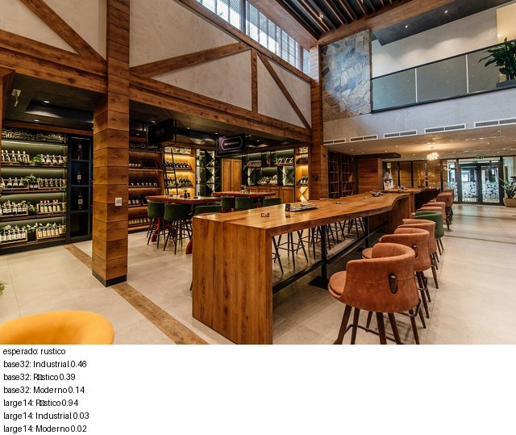
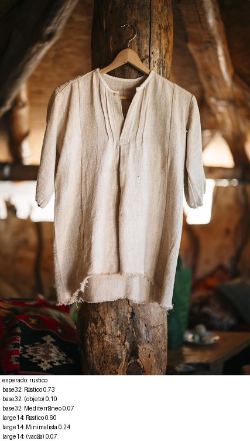
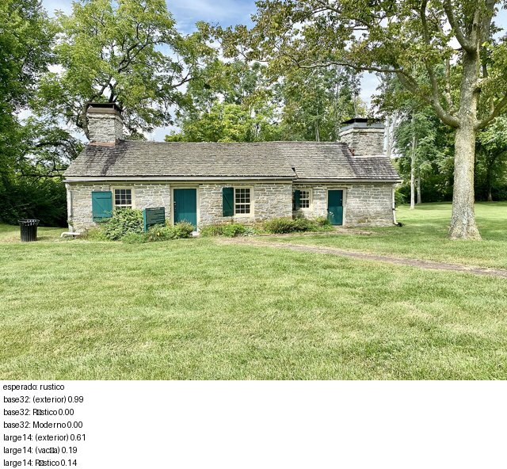
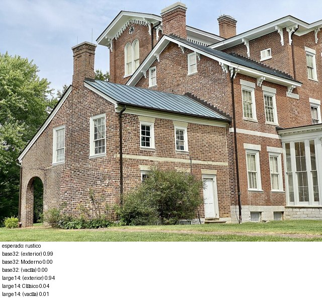
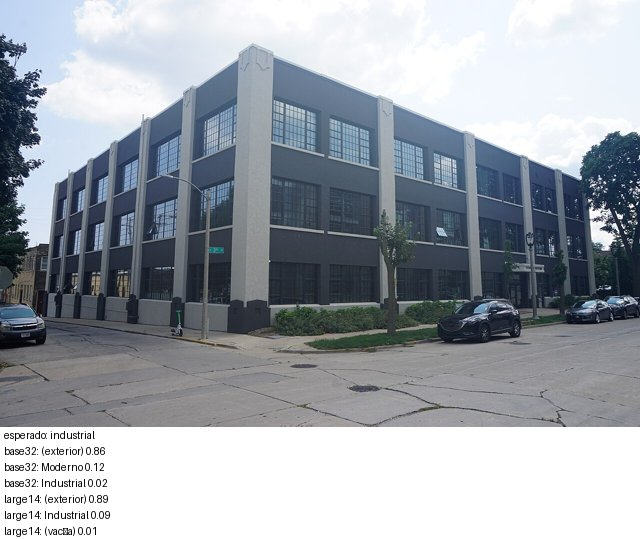
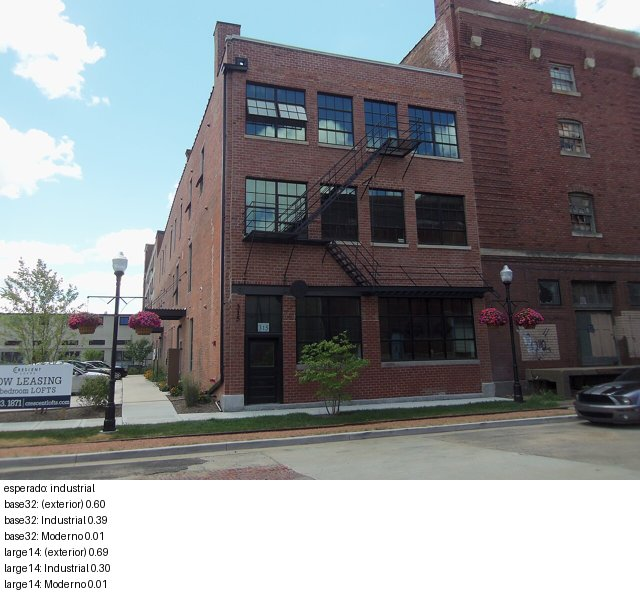
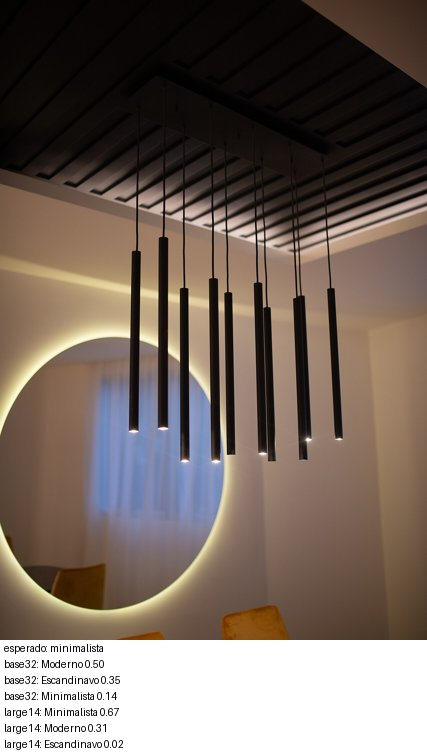
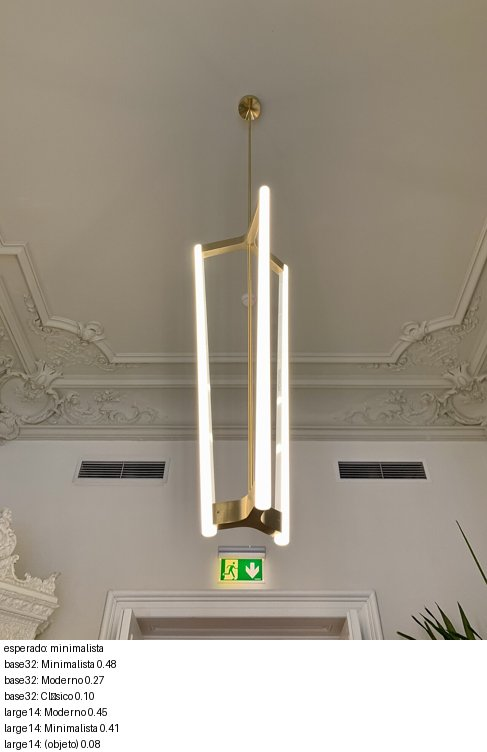
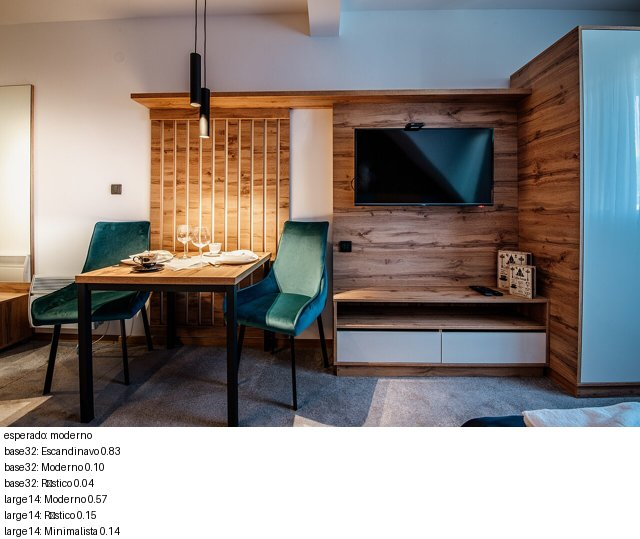

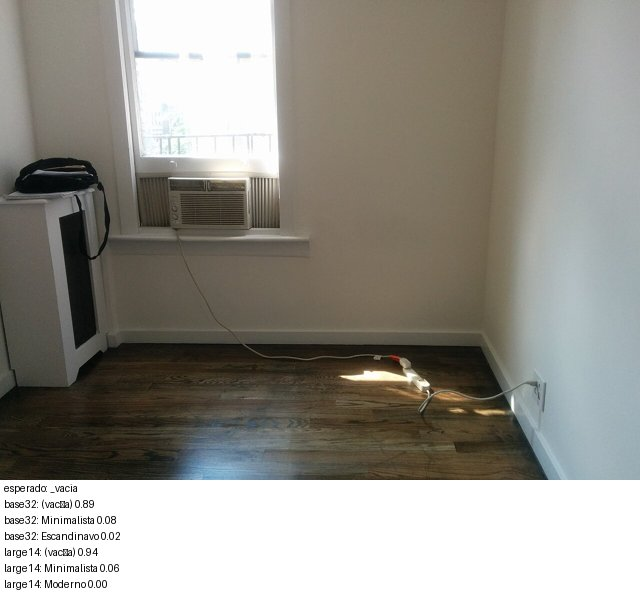
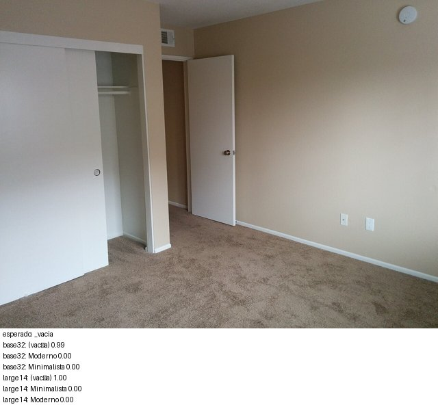

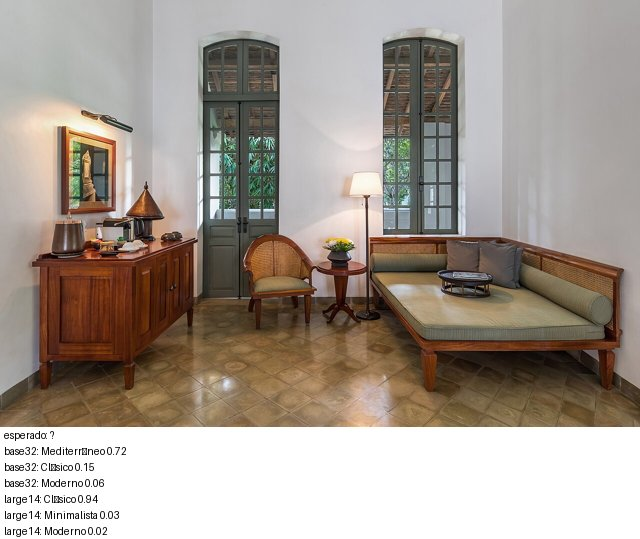
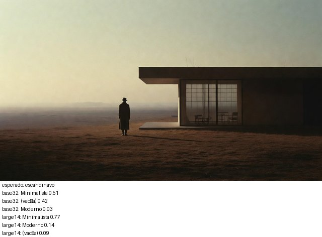

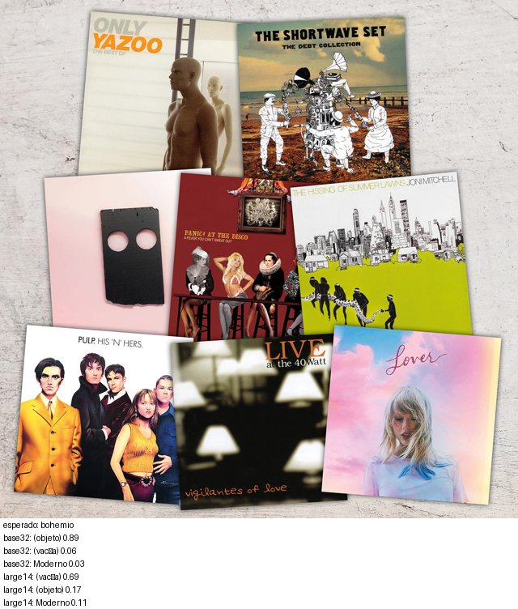
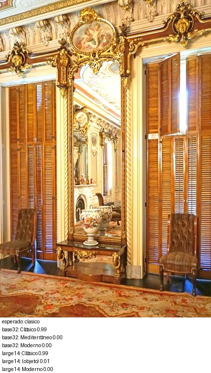
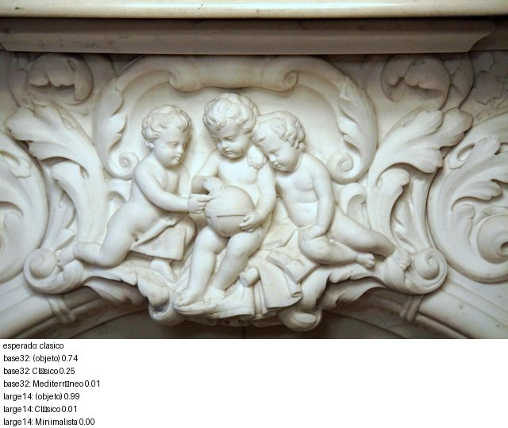
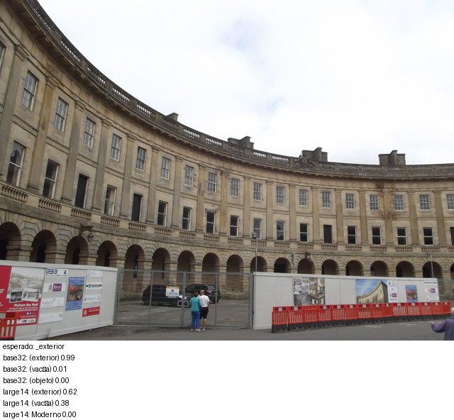
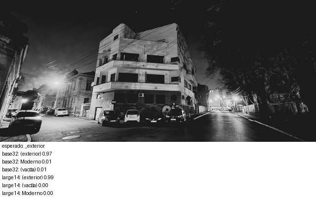

## Atribución

- 01: [File:Modern rustic interior of a spacious bar featuring wooden accents and stylish seating in a lively social setting.jpg](https://commons.wikimedia.org/wiki/File:Modern_rustic_interior_of_a_spacious_bar_featuring_wooden_accents_and_stylish_seating_in_a_lively_social_setting.jpg) — Shixart1985, CC BY 2.0
- 02: [File:Old Serbian traditional shirt hanging on a wooden post in a rustic interior space with woven textiles in Bistrica Serbia.jpg](https://commons.wikimedia.org/wiki/File:Old_Serbian_traditional_shirt_hanging_on_a_wooden_post_in_a_rustic_interior_space_with_woven_textiles_in_Bistrica_Serbia.jpg) — Shixart1985, CC BY 2.0
- 03: [File:Summer Kitchen, White Hall, Richmond, KY.jpg](https://commons.wikimedia.org/wiki/File:Summer_Kitchen,_White_Hall,_Richmond,_KY.jpg) — w_lemay, CC BY-SA 2.0
- 04: [File:Kitchen Wing, White Hall, Richmond, KY.jpg](https://commons.wikimedia.org/wiki/File:Kitchen_Wing,_White_Hall,_Richmond,_KY.jpg) — w_lemay, CC BY-SA 2.0
- 05: [File:Milwaukee August 2024 057 (Square D Company-Industrial Controller Division--Junior House Lofts).jpg](https://commons.wikimedia.org/wiki/File:Milwaukee_August_2024_057_(Square_D_Company-Industrial_Controller_Division--Junior_House_Lofts).jpg) — Michael Barera, CC BY-SA 4.0
- 06: [File:Kerker Lofts.JPG](https://commons.wikimedia.org/wiki/File:Kerker_Lofts.JPG) — Farragutful, CC BY-SA 3.0
- 07: [File:Modern pendant lights illuminate minimalist interior design in stylish dining area during evening hours.jpg](https://commons.wikimedia.org/wiki/File:Modern_pendant_lights_illuminate_minimalist_interior_design_in_stylish_dining_area_during_evening_hours.jpg) — Shixart1985, CC BY 2.0
- 08: [File:Minimalist chandelier in the Mița the Cyclist House, Bucharest.jpg](https://commons.wikimedia.org/wiki/File:Minimalist_chandelier_in_the_Mi%C8%9Ba_the_Cyclist_House,_Bucharest.jpg) — Neoclassicism Enthusiast, CC0
- 09: [File:Elegant dining area in a modern apartment with wooden accents and stylish decor.jpg](https://commons.wikimedia.org/wiki/File:Elegant_dining_area_in_a_modern_apartment_with_wooden_accents_and_stylish_decor.jpg) — Shixart1985, CC BY 2.0
- 10: [File:Modern living room with stylish furniture and a view of the outdoors in a cozy apartment setting.jpg](https://commons.wikimedia.org/wiki/File:Modern_living_room_with_stylish_furniture_and_a_view_of_the_outdoors_in_a_cozy_apartment_setting.jpg) — Shixart1985, CC BY 2.0
- 11: [File:Empty apartment room with extension cord.jpg](https://commons.wikimedia.org/wiki/File:Empty_apartment_room_with_extension_cord.jpg) — aismallard, CC BY-SA 3.0
- 12: [File:Empty room in apartment.jpg](https://commons.wikimedia.org/wiki/File:Empty_room_in_apartment.jpg) — aismallard, CC BY-SA 3.0
- 13: [File:Restaurant room of Amantaka luxury Resort & Hotel in Luang Prabang Laos.jpg](https://commons.wikimedia.org/wiki/File:Restaurant_room_of_Amantaka_luxury_Resort_%26_Hotel_in_Luang_Prabang_Laos.jpg) — Basile Morin, CC BY-SA 4.0
- 14: [File:Lobby lounge of Amantaka Suite Amantaka luxury Resort & Hotel Luang Prabang Laos.jpg](https://commons.wikimedia.org/wiki/File:Lobby_lounge_of_Amantaka_Suite_Amantaka_luxury_Resort_%26_Hotel_Luang_Prabang_Laos.jpg) — Basile Morin, CC BY-SA 4.0
- 15: [Box Living - Melancholy and Light on the Jutland Coast - 20](https://www.flickr.com/photos/197722038@N06/55137487478) — ArtisticPonder, CC CC0 1.0
- 16: [Box Living - Melancholy and Light on the Jutland Coast - 19](https://www.flickr.com/photos/197722038@N06/55137487483) — ArtisticPonder, CC CC0 1.0
- 17: [London - Wigan - London, 17 & 18-07-21](https://www.flickr.com/photos/55497864@N00/51319456009) — Brett Jordan, CC BY 2.0
- 18: [Maine-00405 - The Parlor](https://www.flickr.com/photos/22490717@N02/52513891907) — archer10 (Dennis), CC BY-SA 2.0
- 19: [Maine-00406 - Parlor Fireplace Detail](https://www.flickr.com/photos/22490717@N02/52514357466) — archer10 (Dennis), CC BY-SA 2.0
- 20: [The Crescent, Buxton](https://www.flickr.com/photos/39415781@N06/15227757879) — ell brown, CC BY-SA 2.0
- 21: [Marcel Janco - Solly Gold building 1934, Bucharest](https://www.flickr.com/photos/9019841@N08/51848085965) — fusion-of-horizons, CC BY 2.0