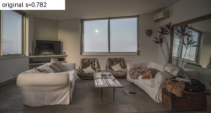

# Variantes por petición: medición con el modelo real

## Modelos candidatos servidos para image-to-image

| Modelo | Proveedores |
|---|---|
| `stabilityai/stable-diffusion-xl-base-1.0` | — ninguno |
| `black-forest-labs/FLUX.1-Kontext-dev` | fal-ai (live), replicate (live), wavespeed (live) |
| `Qwen/Qwen-Image-Edit` | fal-ai (live), wavespeed (live), replicate (error) |
| `timbrooks/instruct-pix2pix` | — ninguno |
| `stabilityai/stable-diffusion-xl-refiner-1.0` | — ninguno |

Modelo usado: `black-forest-labs/FLUX.1-Kontext-dev` (proveedor `auto`), strength 0,55, 30 pasos.

## Latencia (segundos por petición completa)

| Foto | Caso | 1 variante | 2 en paralelo | 3 en paralelo |
|---|---|---|---|---|
| 01 | contraluz (ventanales al atardecer) | — | — | — | ⚠️ quota_exhausted: Se ha agotado el crédito de IA del servicio. La función vuelve a estar disponible cuando se renueve.

## Puntuaciones

| Foto | Original | Variantes (score) | Mejor − peor |
|---|---|---|---|
| 01 | 0.782 | — | — |

Generaciones hechas: 1. Parada: `quota_exhausted`.

Fotos: Wikimedia Commons, atribución en `../results/report.md`.